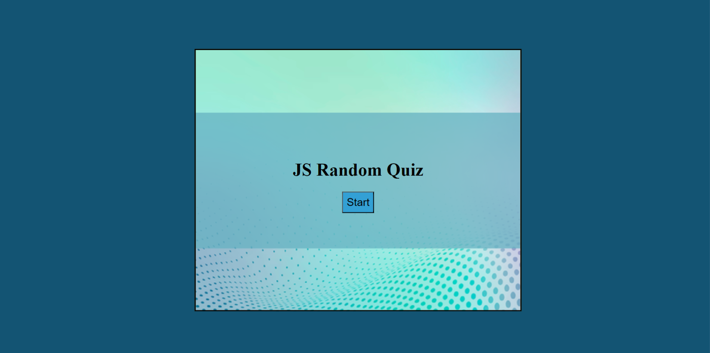
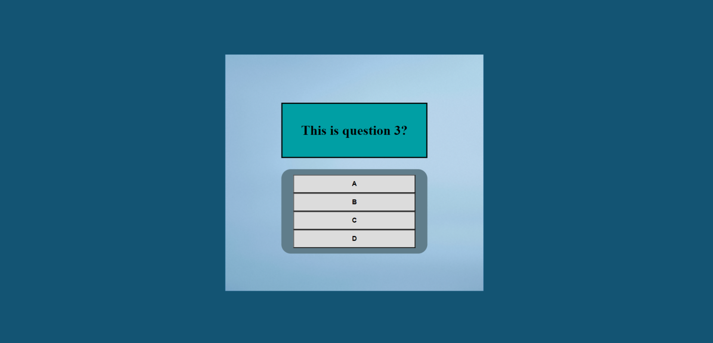
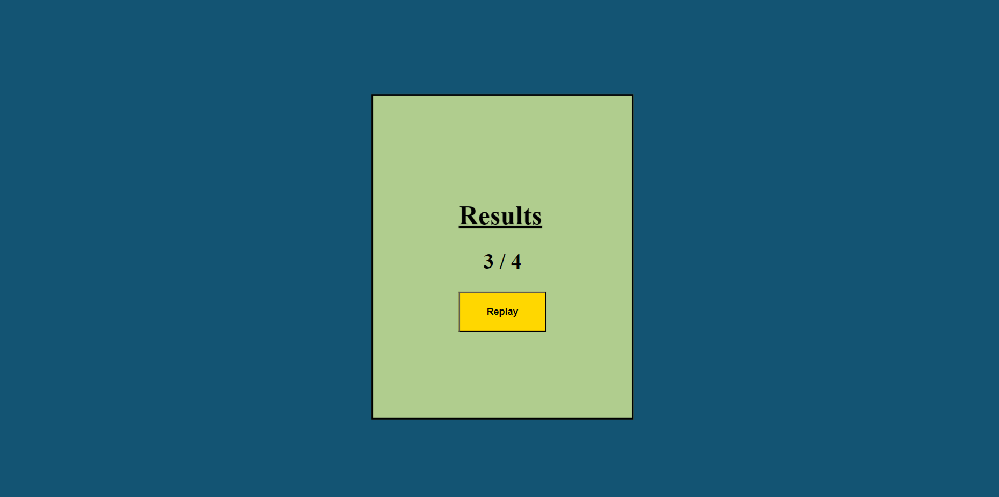

# JS-Random-Quiz
 
  

GitHub repository:https://github.com/RubinoD1/JS-Random-Quiz

GitHub live page: https://rubinod1.github.io/JS-Random-Quiz/

## Index
- [Introduction](#introduction)
- [Technology](#technology)
- [Screenshots](#screenshots)

## Introduction 

**What is JS Random Quiz?** 

JS Random Quiz is a JavaScript built quiz app. It uses an array in the JS file to store the quiz questions. Once the start button is pressed, the array is shuffled in order to randomize the order of the quiz questions. On answering a question, the screen bg color will change depending on whether the answer was correct, or incorrect.  

Once there are no more questions remaining in the array, the score screen will display. The user will see how many questions they have answered correctly and a replay button can be used to play again. The replay button will re-shuffle the quiz so the question order will not be the same as the previous quiz.

**How do I add my own quiz questions?** 

The quizQuestions array found in the script.js file contains the questions that are used in the quiz. The structure of each question is explained in the following code sample: 

```
const quizQuestions = 
[
  {
    question: "This is question 1?", // The question that will be asked 
    answers: ["A", "B", "C", "D"], // The answer choices which will be displayed on the answer buttons 
    correct: "A" // The correct answer
  }
]
```

To add your own questions, simply follow this same format. A comma is needed to separate the questions (no comma is needed for the last question). Bellow is an example of a three-question quiz: 

```
const quizQuestions = 
[
  {
    question: "Your question here",
    answers: ["Correct answer", "B", "C", "D"],
    correct: "Correct answer"
  }, //comma seperates question
  {
    question: "Your question here",
    answers: ["A", "Correct answer", "C", "D"],
    correct: "Correct answer"
  },//comma seperates question
  {
    question: "Your question here",
    answers: ["A", "B", "Correct answer", "D"],
    correct: "Correct answer"
  } //NO COMMA for the last question
];
```
As many questions as desired can be added to the quizQuestions array. 

**IF the body bg-color is changed in the CSS file** 

If a change is made to the body bg-color an update will need to be made to reflect this change in the quiz function. The answerCheck function alters the bg-color of the body as part of the answer validation in order to give user feedback upon selecting an answer. When the quiz function is called, the original body bg-color is restored. Below is an example: 

```
function quiz() {
    document.body.style.backgroundColor = "#135473"; //the upadated color change will need to be made here
}
```

## Technology 

- HTML 
- CSS
- JavaScript 

## Screenshots 



 

 


